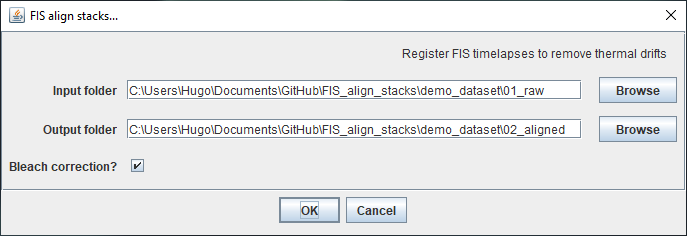
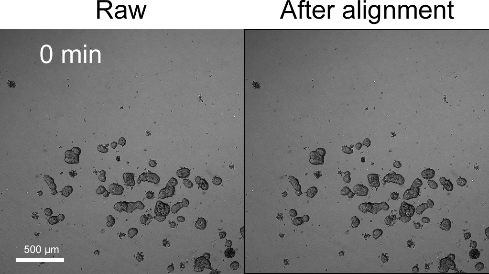

# Registration of forskolin-induced swelling (FIS) timelapse imafes
*ImageJ macro for correction of thermal-indiced drifts and illumination/bleaching artifacts*

## Table of Contents
* [1. Overview](#overview)
* [2. Using the macro](#usage)
* [3. Results](#results)
* [4. Important notes](#notes)
* [5. Contact](#contact)

## <a name="overview">1. Overview</a>

Imaging datasets from the [live cell forskolin-induced swelling (FIS) assay](https://github.com/hmbotelho/FIS_analysis) often show the following time-dependent artifacts: 
1. *Image drift at the beginning of the experiment*. They occur because the multiwel plate used for the experiment is removed from the microscope incubator box (37 ºC) and placed in a nearby bench (<37 ºC) in order for forskolin to be added. The drift is caused by thermal equilibration at the beginning of the experiment.  
2. *Illumination fluctuation or bleaching*. Illumination fluctuations are most common in brightfield images, due to sample inhomogeneity. The calcein dye is prone to bleaching or diffusion out of organoids. Both artifacts modulate the baseline image intensity on organoid-free areas (background).

This macro offsets the images in the timelapse to correct the thermal drift. Bleach correction is optional.

## <a name="usage">2. Using the macro</a>

The macro requires:
* [StackReg](http://bigwww.epfl.ch/thevenaz/stackreg/). Install it by activating the BIG-EPFL update site on Fiji/ImageJ2.  
* An imaging dataset produced by [htmrenamer](https://github.com/hmbotelho/htmrenamer).  

Run the macro on ImageJ/Fiji (FIS_align_stacks.ijm)[./FIS_align_stacks.ijm]. A dialog box will be displayed. Enter the folder with the imaging dataset and the folder where results will be saved. Bleach correction is optional but can improve the accuray of image alignment.

A demonsration dataset is provided [here](./demo_dataset).  

## <a name="results">3. Results</a>

Here is an example of a timelapse before and after processing:  

## <a name="notes">4. Important notes</a>

1. The image alignment results in a slight crop of the images, which is dependent on the magnitude of the thermal drift. The cropped region may not be identical in all images, potentially resulting in different image sizes across wells.  
2. Currently, channels are processed independently: the crop region may be different in channels from the same well.  
3. Bleach correction is performed with the "Histogram Matching" method. Bleach correction will affect image intensity. Bear this in mind if measuring intensities.  

## <a name="contact">5. Contact</a>

Please e-mail me if you have any questions or find any bugs.
hugobotelho@gmail.com
